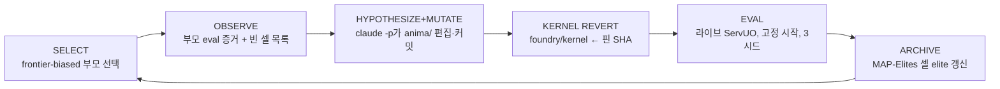
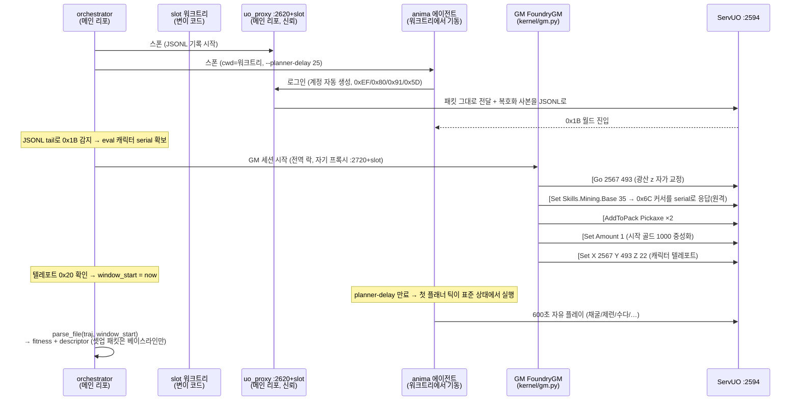

# Foundry 아키텍처 도해 (구현 기준, 2026-06-10)

> 설계 사양은 [`FOUNDRY.md`](FOUNDRY.md), 실행 방법은 [`../foundry/README.md`](../foundry/README.md).
> 이 문서는 **현재 실제로 돌아가는 구조**를 도식으로 정리한 것이다.

## 1. 한눈에 보기 — 진화 루프

```
                ┌──────────────────────────────────────────────────────┐
                │              foundry/orchestrator.py                 │
                │        (K개 슬롯 병렬, 아카이브는 단일 기록자)            │
                └──────────────────────────────────────────────────────┘
                                        │  사이클 i
        ┌───────────────────────────────┼────────────────────────────────┐
        ▼                               ▼                                ▼
┌──────────────┐   ┌──────────────────────────────────┐   ┌──────────────────────┐
│ 1. SELECT     │   │ 2-4. MUTATE (slot 워크트리 안)     │   │ 5-6. EVAL + ARCHIVE  │
│ select.py     │──▶│  git checkout parent.code_ref    │──▶│  kernel/eval.py      │
│ frontier 편향  │   │  claude -p (sonnet, 헤드리스)      │   │  3시드 × 600초 평균    │
│ + 빈 셀 타겟    │   │  → anima/ 한 가지 변이 + 커밋       │   │  kernel/archive.py   │
└──────────────┘   │  → 커널은 핀 SHA로 강제 복원         │   │  → 셀 elite면 그리드 진입│
                   └──────────────────────────────────┘   └──────────────────────┘
                                                                      │
              ┌───────────────────────────────────────────────────────┘
              ▼
   refs/foundry/g_NNNNN  (변이 커밋 영구 보존)  +  foundry/archive/genomes/*.json (계보)
```



## 2. 신뢰 경계 — 커널(자) vs 가변 영역(진화 대상)

```
╔════════════════ 인간 소유(KERNEL) — 매 eval 전 핀 SHA로 복원 ═══════════════╗
║  foundry/kernel/                                                          ║
║    trajectory.py   와이어 독자 파서 (anima를 절대 import하지 않음)             ║
║    fitness.py      점수 = gate × (skill + 0.3·worth + 0.2·produce + bonus) ║
║    descriptor.py   행동 좌표 (직업 × 사교성) — 셀 결정                        ║
║    archive.py      승격 규칙: 빈 셀 채움 or 기존 elite 초과 시에만              ║
║    eval.py / gm.py 고정 시작 + 채점 윈도우                                   ║
║    safety.py       커널 복원·STOP·게놈 상한                                  ║
╚════════════════════════════════════════════════════════════════════════╝
                ▲ 점수를 매기는 자(ruler)는 절대 변이되지 않는다
                │
╔═══════════════ 가변(MUTABLE) — Claude가 자유롭게 재작성 ═══════════════════╗
║  anima/            게놈 본체 (플래너·절차·움직임·페르소나) ← 변이의 주 대상      ║
║  foundry/select.py · observe.py · mutate.py · orchestrator.py (Phase 3+) ║
╚═══════════════════════════════════════════════════════════════════════╝
```

## 3. 한 번의 평가 (eval) — 시퀀스



핵심 장치:
- **GM 셋업은 윈도우 밖**: `window_start` 이전 패킷은 스킬 베이스라인 이동·소유 컨테이너 등록만 하고 **절대 점수에 누적되지 않음** (GM이 준 곡괭이가 생산으로 잡히거나, 스킬 세팅이 게인으로 잡히는 것 차단)
- **GM은 원격 serial 타겟팅**: 0x6C 커서에 eval 캐릭터 serial로 응답 — GM이 캐릭터에게 걸어가지 않으므로 병렬 슬롯 간 간섭 없음
- **GM도 Huffman 불필요**: 자기 uo_proxy의 복호화된 JSONL을 tail해서 서버를 "읽음"

## 4. 채점 데이터 흐름 — 서버 패킷만 믿는다

```
ServUO 패킷 (ground truth)            TrajectorySummary                점수
──────────────────────────          ─────────────────────          ────────────────
0x3A SkillUpdate         ──────▶    skills[id].first/last  ──┐
0x11 Status (gold/무게)   ──────▶    gold_samples            │     fitness.py
0x25 AddToContainer      ──────▶    items_into_pack         ├──▶  gate × (skill·1.0
0x22/0x21 걸음 확인/거부    ──────▶    steps, loop 비율          │      + worth·0.3
0x02/0xAD… C→S 행동       ──────▶    action_counts, speech   │      + produce·0.2
0x1B/0x20 위치            ──────▶    positions (8×8 region)  ─┘      + bonus*)
                                          │
                                          └──────▶  descriptor.py
                                                    직업(스킬 카테고리 argmax)
                                                    × 사교성(발화/행동 비율)
                                                    = 그리드 셀 좌표
```
\* Tier-3 bonus는 **셀 정렬**: 사교 보너스는 전 셀, 탐험/전투 보너스는 직업 없는(NONE) 아키타입 전용.

## 5. 병렬 오케스트레이션 (Phase 1)

```
메인 리포 (HEAD 고정)                      ServUO :2594 (단일 샤드)
├── 채점 커널 실행 (이 프로세스의 import)          ▲      ▲      ▲
├── uo_proxy 실행 (신뢰 기록자)                  │      │      │
│                                       ┌────┴─┐  ┌─┴────┐  └─ GM (직렬화 락)
├── .worktrees/slot0  ← parent A 코드 ──▶│agent │  │agent │
│      └ claude -p 변이 → 커밋            │ A'   │  │ B'   │   계정: evo<run>cN
├── .worktrees/slot1  ← parent B 코드 ──▶└──────┘  └──────┘   (시드마다 신규)
│
├── foundry/archive/   ← 메인 스레드만 기록 (단일 기록자)
└── refs/foundry/g_*   ← 아카이브된 변이 커밋을 GC로부터 보존
```

| 자원 | slot 0 | slot 1 | 비고 |
|---|---|---|---|
| 에이전트 프록시 | :2630 | :2631 | trajectory JSONL 분리 |
| GM 프록시 | :2730 | :2731 | GM 세션은 락으로 한 번에 하나 |
| 웹 대시보드 | :8170 | :8171 | 라이브 관전 |

## 6. MAP-Elites 그리드 — "다양한 영혼의 박물관"

활성 축 (Phase 0–2): **직업 7 × 사교성 3 = 21셀**. 셀마다 그 행동 유형의 최고 fitness 게놈 하나만 보관.

```
              soc-low          soc-mid          soc-high
GATHERING   [묵묵한 광부]      [수다 광부]           ·          ← fitness는 셀 안에서만 경쟁
CRAFTING        ·                ·                ·          ← 빈 셀 = EXPLORE 변이 타겟
COMBAT          ·                ·                ·
MAGIC           ·                ·                ·
BARD-SOCIAL     ·                ·                ·
THIEF-STEALTH   ·                ·                ·
NONE            ·                ·             [명상가?]      ← 스킬 게인 없는 표현형 보호 구역
```

- **improved**: 같은 셀 점유자보다 높은 fitness → 교체 (예: 수다 광부 15.5 → 16.4)
- **filled**: 빈 셀 진입 → 낮은 점수여도 다양성 가치로 보존
- 부모 선택은 빈 셀과 인접한 elite를 우대 (frontier bias) → 그리드가 바깥으로 자란다

## 7. 안티-리워드-해킹 — 신뢰는 어디서 오는가

| 장치 | 구현 |
|---|---|
| 자(ruler) 변조 불가 | 매 eval 전 `git checkout <pin> -- foundry/kernel` |
| 자기보고 불신 | fitness는 uo_proxy가 독립 캡처한 서버 패킷만 사용 |
| 기록자 보호 | uo_proxy·채점 커널은 항상 **메인 리포**에서 실행 (워크트리 변이 무효) |
| 셋업 오염 차단 | `window_start` 이전 = 베이스라인 전용 (스킬 점프·지급품 무효) |
| 선적재 차단 | GM이 시작 골드 중성화, 시드는 Mining 단일 스킬 템플릿 |
| 백본 자체 견제 | UO 스킬 게인은 서버가 확률·캡으로 스스로 조임 |
| 생존은 게이트 | viability = alive × liveness × (1−loop) — 곱셈이라 우회 불가 |
| 폭주 방지 | `foundry/STOP` 파일, 런당 게놈 상한, 변이 타임아웃 |

## 8. 파일 맵

```
foundry/
├── kernel/              ← 인간 소유 (위 §2)
│   ├── trajectory.py    패킷 → TrajectorySummary (window_start 지원)
│   ├── fitness.py       점수 산식 (가중치 잠금)
│   ├── descriptor.py    QD 축 + 셀
│   ├── archive.py       게놈 저장 + 그리드 승격 규칙
│   ├── eval.py          라이브 평가 + run_eval_multi(시드 평균)
│   ├── gm.py            GM 와이어 클라이언트 + FIXED_START_PROFILES
│   ├── provision.py     GM 계정 1회 프로비저닝
│   └── safety.py        핀 복원·STOP·상한
├── select.py            부모 선택 정책        ← Phase 3에서 변이 개방
├── observe.py           변이용 관찰 보고서     ← Phase 3에서 변이 개방
├── mutate.py            claude -p 변이 연산자 ← Phase 3에서 변이 개방
├── orchestrator.py      병렬 develop 루프     ← Phase 3에서 변이 개방
├── status.py            그리드/계보 뷰어
└── archive/             genomes/*.json + grid.json (런 데이터)
```
